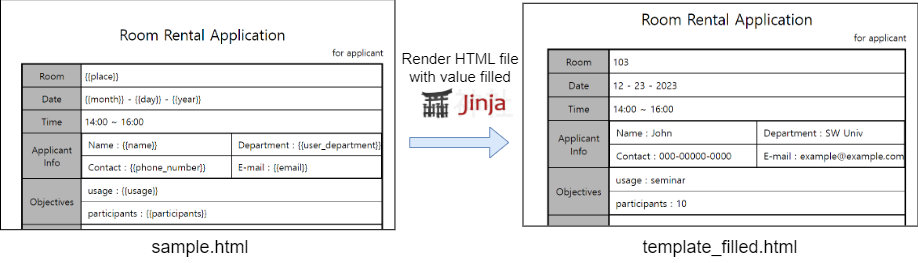
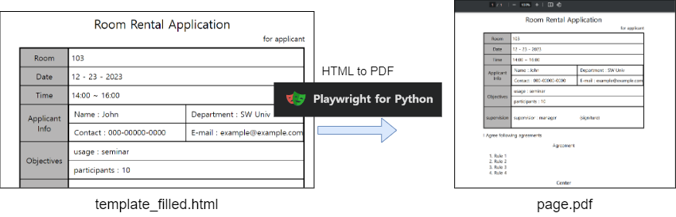

# PDF generator

Generating PDF files using python

## Requirements

1. HTML

2. Python

## How it Works

PDF are generated from rendered documents like `HTML` and document files like MS Words' `docx`.

We genertate HTML file filled with values, and then print as PDF file from browser engine, in this case **Chromium** from Google



First, by using Jinja, replace values and write new HTML file.



Second, Playwright use Chromimum engine to render HTML file page.

You get PDF file

## 1. Generating by running python script (CLI folder)

```bash
> pip install -r requirements.txt

> playwright install # or python -m playwright install

> cd ./app

> python .\pdfmaker.py
```
